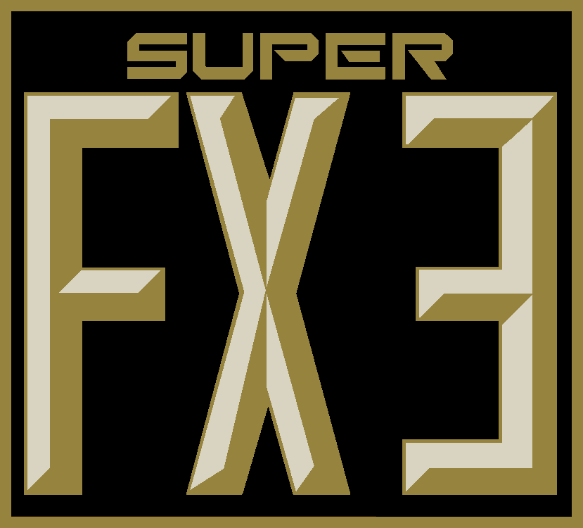
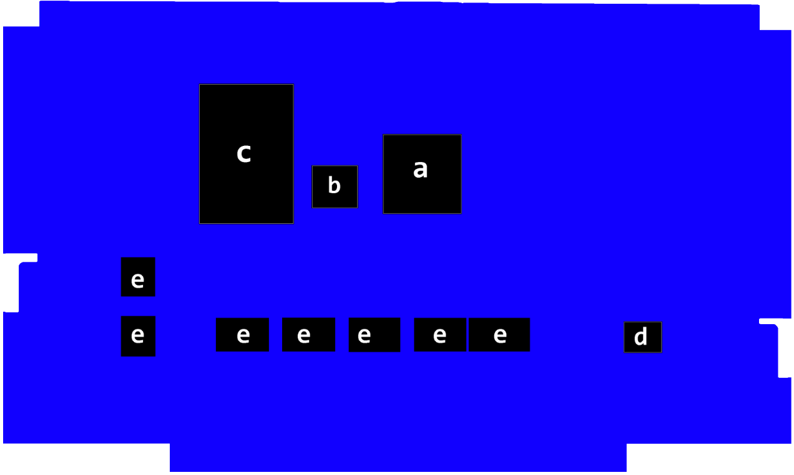
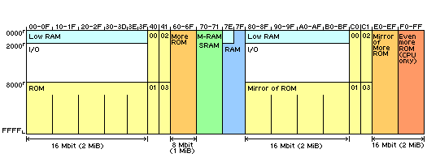
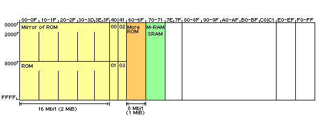

# Super NES "FX3" GSU Technical Specifications

<hr>

Document version 1.0, June 6 2026 &nbsp; &nbsp; &nbsp; &nbsp; &nbsp; &nbsp; &nbsp; &nbsp; &nbsp; &nbsp; Randal Linden

### 1. Overview

<u>**FX3 is an enhanced version of the SuperFX chip (GSU) and is "mostly" compatible with the original hardware.**</u>

<u>There are a few improvements compared to the SuperFX chip:</u>

1. The FX and 65816 are able to access ROM and FX SRAM ("MARIO RAM") simultaneously

2. 65816 "Fast ROM" is supported (Banks `$80`-`$FF`) as Mode `$30`

3. FX ROM is increased to 3MB (Banks `$60`-`$6F` are 64K banks)

4. 65816 ROM is increased to 4MB (Banks `$C0`-`$FF` are 64K banks)

5. Effective speed increase of about 4x (approximately 85.6Mhz)

<u>When running on hardware (not under emulation), there are some important differences:</u>

1. There is an internal RAM frame buffer in chunky format (1 byte per pixel)

2. The PLOT command (`$4C`) writes directly to the frame buffer at high speed

3. FX Interrupts are not supported (all other regular IRQs are supported)

4. Software must check when the FX stops executing code by polling R15

5. Battery backup (saving) is not supported.

### 2. Software

<u>**Here are some important notes regarding software:**</u>

1. FX hardware registers are located at `$007000`
2. Reading from R15 is allowed when the FX is running
3. The STOP opcode (`$00`) sets R15 to 0
4. The MERGE opcode (`$70`) has been repurposed (see section 5 below.)
5. The VCR register will return `$52` for FX3
6. The ROM Header Cartridge Type (at `$FFD6`) should be `$17` for FX3 (`$18` for FX3 with Battery)

### 3. Emulation

<u>**Development, testing and debugging of FX programs is fully supported using the MesenCE software emulator.**</u>

FX Interrupts (IRQs) are supported (fired when the STOP command is executed.)

### 4. Hardware

<u>**The major components of the cartridge board include:**</u>

a. Raspberry Pi RP2350B microcontroller (running at 150Mhz)  
b. QSPI flash device (FX ROM)  
c. Parallel flash device (65816 ROM)  
d. PIC 12F629 (CIC security)  
e. Level conversion logic  



### 5. Firmware-Assisted Support Functions

| #   | Function Description     |
| --- | ------------------------ |
| 0   | Chunky-To-Planar Third A |
| 1   | Chunky-To-Planar Third B |
| 2   | Chunky-To-Planar Third C |
| 3   | Clear Third A            |
| 4   | Clear Third B            |
| 5   | Clear Third C            |

**The MERGE opcode (`$70`) has been repurposed to support a small number of firmware-based functions which are callable from the FX when running on hardware.**

The functions assume an 8bpp frame buffer at `$710000` configured as 256 dots wide by 160 dots tall. The frame buffer is divided into thirds (A,B,C) which are 9 characters wide by 18 characters tall.

The Chunky-To-Planar functions are not used when running under the MesenCE emulator (executing a C2P operation is effectively a "no-operation".)

<u>To use one of the functions, set R0 to the function number and execute a MERGE opcode.</u>

<u>Example code:</u>

```
	move	r0,#0		; Chunky-To-Planar Third A
	merge
```

<u>A replacement MERGE operation can be done with the following sequence of instructions:</u>

```
	move	rTemp,r7	; Preserve R7

	from	r8			; R8 High Byte to Destination Low Byte
	to		rDest
	hib

	with	r7			; R7 High Byte
	hib

	with	r7
	swap

	with	rDest		; Merge R7 High Byte
	or		r7

	move	r7,rTemp	; Restore R7
```

### 6. 65816 Memory Map



Banks `$00`-`$3F` are upper-32KB banks

Banks `$40`-`$6F` are 64KB banks (3MB total)

Banks `$70`-`$71` are FX SRAM ("MARIO RAM")

Banks `$80`-`$BF` are upper-32KB banks (mirror of banks `$00`-`$3F`)

Banks `$C0`-`$EF` are 64KB banks (mirror of banks `$40-$6F`)

Banks `$F0`-`$FF` are 64KB banks (4MB total)

### 7. FX3 Memory Map



Banks `$00`-`$3F` are upper-32KB banks (mirrored to lower-32KB banks)

Banks `$40`-`$6F` are 64KB banks (3MB total)

Banks `$70`-`$71` are FX SRAM ("MARIO RAM")